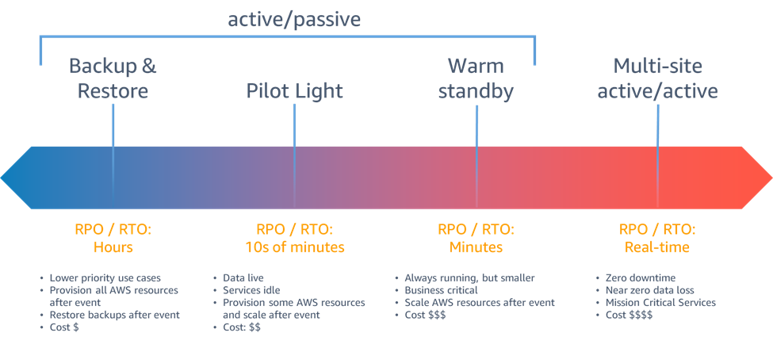
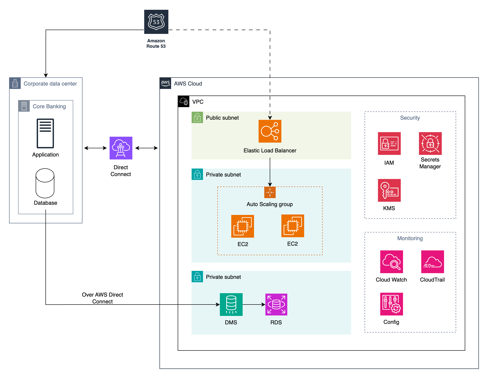
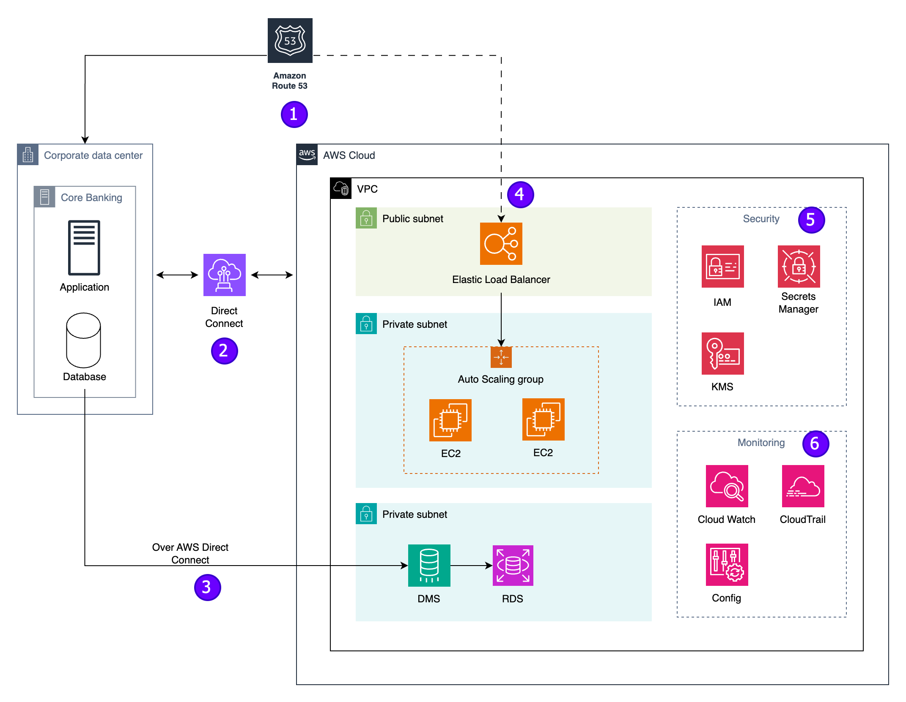

# Disaster Recovery for Core Banking System on AWS Cloud

## Disaster Recovery With AWS

In the fast-paced world of banking systems, making sure that core services remain resilient and accessible is crucial. With the help of AWS cloud, we can employ variety of disaster recovery (DR) strategies, providing a range of options to suit different business needs. Let's delve into these strategies, categorizing them broadly into four approaches

1. **Backup & Restore:**
   - **Details:** This fundamental strategy involves regular backups of data, configurations, and applications. In the event of a disaster, the system is restored to a previous state.
   - **When to Use:** Suitable for systems with moderate recovery time tolerance and less stringent RTO (Recovery Time Objective) requirements. Most cost-effective solution.
   - **When Not to Use:** Not recommended for scenarios where near-zero downtime is crucial for core banking operations.

2. **Pilot Light:**
   - **Details:** The Pilot Light approach maintains a minimal version of the core system in the cloud. It involves preconfiguring essential elements, allowing for rapid scaling and recovery in case of a disaster.
   - **When to Use:** Appropriate when a quick recovery is necessary, and the focus is on minimizing ongoing costs.
   - **When Not to Use:** May not be suitable for systems where rapid scaling is a critical requirement, and the cost of maintaining a minimal system is not justified.

3. **Warm Standby:**
   - **Details:** Warm standby keeps a scaled-down version of the entire system ready to take over swiftly in the event of a disaster. It strikes a balance between cost-effectiveness and the urgency of rapid recovery.
   - **When to Use:** Suitable when quick recovery is crucial, and cost considerations are significant.
   - **When Not to Use:** May not be the most cost-efficient option for systems with lower availability requirements.

4. **Multi-Site Active-Active:**
   - **Details:** This advanced strategy involves running multiple active sites simultaneously. Each site is fully operational, providing high availability and fault tolerance.
   - **When to Use:** Ideal for systems demanding continuous availability, real-time data synchronization, and the ability to handle a complete failure of one site.
   - **When Not to Use:** May be overkill for systems where cost-effectiveness is a higher priority than constant active redundancy.

Among the various AWS disaster recovery options, the Warm Standby approach emerges as the ideal fit for core banking operations due to its adept combination of rapid recovery capabilities and cost-effectiveness.

## Proposed Architecture:

#### AWS Service Overview:

- **Route 53:** Scalable Domain Name System (DNS) web service.
- **Elastic Load Balancer (ELB):** Distributes incoming application traffic across multiple targets.
- **Amazon EC2 (Elastic Compute Cloud):** Scalable virtual servers in the cloud.
- **Auto Scaling Group:** Ensures the availability and scalability of EC2 instances.
- **Amazon RDS (Relational Database Service):** Managed database service for relational databases.
- **Database Migration Service (DMS):** Facilitates the migration of databases to AWS securely.
- **Virtual Private Cloud (VPC):** Isolated cloud resources with customizable network configurations.
- **AWS Direct Connect:** Establishes dedicated network connections from on-premises data centers to AWS.
- **IAM (Identity and Access Management):** Manages access to AWS services securely.
- **Secrets Manager:** Safely stores and retrieves sensitive information.
- **Key Management Service (KMS):** Manages encryption keys for secure data handling.
- **Amazon CloudWatch:** Monitoring service for AWS resources and applications.
- **AWS X-Ray:** Provides insights into the behavior of applications.
- **AWS CloudTrail:** Records API calls for auditing and governance.

## Architecture Breakdown

1. **Route53 for Intelligent DNS Routing:**
   - Normally routes traffic to the on-premise system.
   - In the event of a disaster, facilitates failover, redirecting traffic to the cloud for seamless continuity.

2. **AWS Direct Connect:**
   - Provides transparent and resilient connectivity, linking customer data centers to the AWS Cloud.
   
3. **AWS Database Migration Service (AWS DMS):**
   - Migrates and replicates data from on-premises data centers to Amazon Relational Database Service (Amazon RDS).
   - Ensures the source database remains fully operational during migration, minimizing application downtime.

4. **Virtual Private Cloud (VPC) with Elastic Load Balancer:**
   - Strengthens system security through AWS Virtual Private Cloud (VPC) to shield application and database servers from public internet access
   - Utilizes Elastic Load Balancer exclusively as an internet-facing component to efficiently distribute traffic across multiple application instances
   - Employs an Autoscaling Group to seamlessly manage EC2 instances, automatically adjusting the scale in or out based on real-time traffic conditions.

5. **Security Measures:**
    - IAM: manage access to AWS services and resources securely
    - Secrets Manager: store and manage sensitive information such as API keys, database passwords, and other credentials
    - KMS is utilized for creating and managing encryption keys
   
6. **System Monitoring:**
   - CloudWatch: comprehensive monitoring.
   - Implements alarms to trigger EC2 auto-scaling.
   - Incorporates X-Ray to track cross-services communication.
   - AWS Config to ensure security vulnerabilities are promptly addressed.
